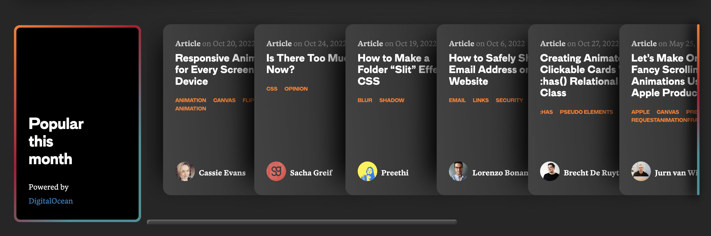
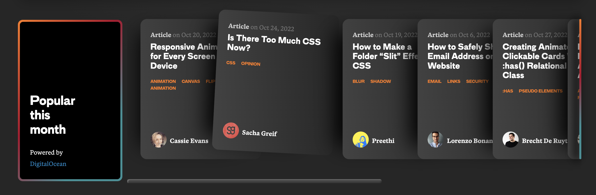

# Frontend Effects:

A repo for recreating interesting frontend effects from the web.

## Running the development server:

In the project directory, you can run:

### `yarn start`

Runs the app in the development mode.\
Open [http://localhost:3000](http://localhost:3000) to view it in the browser.

The page will reload if you make edits.\
You will also see any lint errors in the console.

## Effect 1 - Layered cards hover effect from css-tricks.com:

### Pseudo-code:

- Wrapper div with overflow x for scrolling
- Title card on left
- Mapped items within div
- Gradient/shadow effect on cards (which one?)
- Layering effect (incrementing z-indexes with mapping?)
- Scrollbar styles and effect on different divs at different break points.
- Hover effect:
  - Cards to right shift right.
  - Hovered card rotates around the top-right corner?
  - Media query sets rotate on not-first-children only at xl breakpoint.
